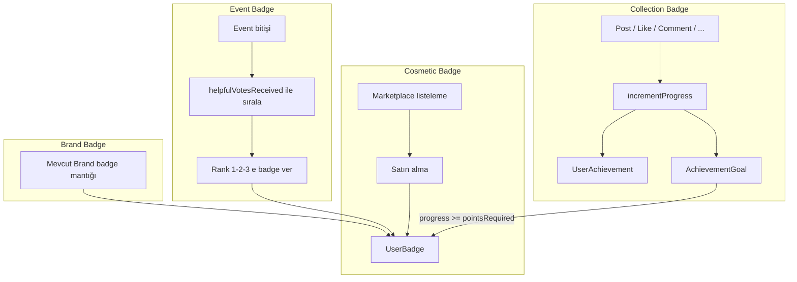

# Badge ve Collection Sistemi – Birleşik Plan

Bu dokümanda konuşulan tüm güncel kararlar tek planda toplanmıştır. Eski/tekrarlayan plan dosyaları (9a8f2ab3, e56dd812) bu içerikle değiştirilmiş kabul edilir.

---

## 1. Badge Tipleri (4 tip)

| Tip            | Kazanım / Kaynak                                                   | Mekanizma                                                                                                                                                |
| -------------- | ------------------------------------------------------------------ | -------------------------------------------------------------------------------------------------------------------------------------------------------- |
| **Cosmetic**   | Marketplace’te listelenir, satın alınır.                           | Biz listeliyoruz; kullanıcı satın alır. Goal/event yok.                                                                                                  |
| **Event**      | Bir event içinde kazanılır.                                        | **Upvote**: event bittikten sonra en çok upvote alan 1–3 kişi badge kazanır. Sisteme yüklenir, event ile eşleştirilir. Diğer aksiyonlardan **bağımsız**. |
| **Collection** | Action’lara göre arka planda sürekli işleyen hedeflerle kazanılır. | Main Action + Action Type + sayısal hedef (pointsRequired); hedefe ulaşan kullanıcıya badge verilir.                                                     |
| **Brand**      | Marka ile ilişkili.                                                | Kalacak; mevcut Brand badge mantığı korunur.                                                                                                             |

---

## 2. BadgeCollection (tek tablo: Identity + Strategy + Logic + Banner)

**Chain kavramı → BadgeCollection.** Collection’ın doğrudan “goals” ilişkisi yok; badge’ler `Badge.collectionId` ile koleksiyona bağlanır. Identity, Strategy ve Logic kartları **aynı tabloda** birleştirilir; eleme/sadeleştirme uygulama aşamasında yapılabilir.

### 2.1 BadgeCollection tablosu (birleşik)

**Temel**

| Alan                | Tip     | Açıklama                                              |
| ------------------- | ------- | ----------------------------------------------------- |
| id                  | UUID    | PK                                                    |
| name                | String  | Koleksiyon adı (örn. "Tipbox Rookie")                 |
| bannerUrl           | String? | **Collection banner** görseli (URL).                  |
| owner               | String? | Sahibi (örn. "Aycan K.")                              |
| collectionObjective | String? | Amaç (onboarding, dijital kimlik, envanter vb.)       |
| targetVertical      | String? | Hedef dikey (Hybrid vb.)                              |
| productScope        | String? | Ürün kapsamı (General, Electronics, Cosmetics vb.)    |
| collectionType      | String? | Resmi / Tipbox vb.                                    |
| hookPitch           | String? | Hook / pitch metni                                    |
| visualTheme         | String? | Görsel tema (Blueprint vb.)                           |
| completionBonus     | String? | Tamamlama bonusu (örn. "Rookie Profil Frame (Basic)") |

**Strategy**

| Alan            | Tip     | Açıklama                                    |
| --------------- | ------- | ------------------------------------------- |
| primaryKpi      | String? | Birincil KPI (örn. Inventory Volume)        |
| secondaryKpi    | String? | İkincil KPI                                 |
| targetAudience  | String? | Hedef kitle (New Users / TestFlight vb.)    |
| campaignContext | String? | Kampanya bağlamı (Seasonal, App Launch vb.) |
| successMetric   | String? | Başarı metriği (%80 tamamlama vb.)          |
| sponsorship     | String? | Sponsorluk                                  |

**Logic**

| Alan               | Tip       | Açıklama                                       |
| ------------------ | --------- | ---------------------------------------------- |
| unlockCondition    | String?   | Kilit açma koşulu (NONE / varsayılan açık vb.) |
| scheduleLaunchDate | DateTime? | Plan / lansman tarihi                          |
| timeStockLimit     | String?   | Zaman / stok limiti (Unlimited vb.)            |

**Kategori (kritik)**

| Alan       | Tip           | Açıklama                                                                                                                                                                                               |
| ---------- | ------------- | ------------------------------------------------------------------------------------------------------------------------------------------------------------------------------------------------------ |
| categoryId | FK → Category | **Mevcut Category tablosu** ile ilişki; id ile eşleştirme. Koleksiyon hangi kategoriye ait. Nested (3 seviye) yapı ileride eklenebilir; şimdilik tek categoryId yeterli, ilişki Category.id üzerinden. |

**Ortak**

| Alan      | Tip      |
| --------- | -------- |
| createdAt | DateTime |
| updatedAt | DateTime |

İlişki: `BadgeCollection` has many `Badge` (badges.collectionId → BadgeCollection). Collection’da goals alanı yok; goal’lar AchievementGoal üzerinde, rewardBadge → Badge, Badge.collectionId → BadgeCollection.

---

## 3. BadgeCategory (sadece 4 kayıt, İngilizce)

**BadgeCategory** tablosu yalnızca aşağıdaki 4 kayıttan oluşur. name ve description **İngilizce** olacak.

| name       | description (örnek)                                            |
| ---------- | -------------------------------------------------------------- |
| Cosmetic   | Badges available for purchase in the marketplace.              |
| Event      | Badges earned during events (e.g. by upvote ranking).          |
| Collection | Badges earned by completing action-based goals in collections. |
| Brand      | Badges associated with brands.                                 |

**Seed:** BadgeCategory için mevcut seed verileri silinir; sadece bu 4 satır insert edilir (name ve description İngilizce).

---

## 4. Badge ve İlişkiler

### 4.1 Badge tablosu

- **type**: `COSMETIC` | `EVENT` | `COLLECTION` | `BRAND`.
- **collectionId** (FK, nullable): Sadece `COLLECTION` tipi badge’lerde dolu; hangi BadgeCollection’a ait.
- **categoryId**: BadgeCategory (Cosmetic / Event / Collection / Brand) ile ilişki.
- Diğer: name, description, imageUrl, rarity, boostMultiplier, rewardMultiplier, createdAt.

### 4.2 Tipe göre kullanım

- **Cosmetic**: type = COSMETIC, collectionId = null. Marketplace’te listelenir, satın alım → UserBadge.
- **Event**: type = EVENT, collectionId = null. Event’e EventBadge (eventId, badgeId, rank) ile eşlenir; upvote ile kazanılır.
- **Collection**: type = COLLECTION, collectionId dolu. AchievementGoal.rewardBadgeId ile hedefe bağlanır; action progress ile kazanılır.
- **Brand**: type = BRAND; mevcut mantık korunur.

---

## 5. Event Badge Mekanizması (Upvote)

- Bir event’te **min 1, max 3** badge.
- **Kazanım**: Etkinlik bittikten sonra **en çok upvote (helpfulVotesReceived) alan** 1–3 kullanıcı sırayla badge kazanır. Diğer aksiyonlardan bağımsız.

**EventBadge** (sadeleştirilmiş): id, eventId, badgeId, rank (1/2/3), displayOrder?, enabled, createdAt, updatedAt. Unique(eventId, rank). requirementType/threshold kaldırılır.

**Upvote kaynağı**: EventStats.helpfulVotesReceived (userId + eventId).

**Akış**: Event bitince EventBadge’leri rank’e göre al; EventStats’ta helpfulVotesReceived’a göre sırala; rank 1 badge 1. kullanıcıya, rank 2 ikinciye, rank 3 üçüncüye ver (UserBadge).

---

## 6. Collection Badge Mekanizması (Action + Goal)

- **AchievementGoal**: chainId kaldırılır → **collectionId** (FK → BadgeCollection) kullanılır. mainAction, actionTypeId (FK → ActionType), pointsRequired, rewardBadgeId (COLLECTION badge), difficulty, title, requirement. eventId yok.
- **ActionType** tablosu: id, mainAction, code, label; unique(mainAction, code). Type-safe; serbest string yok.
- **MainAction** enum: POST, LIKE, COMMENT, BOOKMARK, JOIN, SYSTEM.
- **UserAchievement**: Sadece Collection goal’ları için progress (userId, goalId, progress, completed, completedAt).
- Tetikleyiciler: post, like, comment, bookmark, join, profile/bio/inventory vb. → incrementProgress(userId, mainAction, actionTypeId, amount). progress >= pointsRequired → UserBadge.

---

## 7. Entity ve Tablo Özeti

| Tablo / Entity      | Amaç                                                                                                              |
| ------------------- | ----------------------------------------------------------------------------------------------------------------- |
| **BadgeCollection** | Identity+Strategy+Logic tek tablo; bannerUrl; categoryId → Category. Goals yok; badge’ler collectionId ile bağlı. |
| **Badge**           | type: COSMETIC                                                                                                    |
| **BadgeCategory**   | Sadece 4 kayıt: Cosmetic, Event, Collection, Brand (name/description İngilizce).                                  |
| **Category**        | Mevcut tablo; BadgeCollection.categoryId ile ilişki (id). 3 seviye nested ileride planlanacak.                    |
| **UserBadge**       | Kullanıcının kazandığı/satın aldığı badge.                                                                        |
| **EventBadge**      | eventId, badgeId, rank (1–3). Event bitince upvote sırasına göre dağıtım.                                         |
| **AchievementGoal** | collectionId, mainAction, actionTypeId, pointsRequired, rewardBadgeId (COLLECTION), difficulty.                   |
| **UserAchievement** | Sadece Collection goal’ları için progress.                                                                        |
| **ActionType**      | mainAction + code (unique).                                                                                       |
| **MainAction**      | Enum: POST, LIKE, COMMENT, BOOKMARK, JOIN, SYSTEM.                                                                |

Kaldırılacak: **AchievementChain**. EventBadge’den requirementType/threshold kaldırılır.

---

## 8. Seed Kuralları

### 8.1 BadgeCategory

- Mevcut BadgeCategory seed verileri **silinir**.
- Sadece **4 kayıt** eklenir: Cosmetic, Event, Collection, Brand. **name** ve **description** alanları **İngilizce** yazılır (yukarıdaki tabloya göre).

### 8.2 Badge ile ilgili tüm seed kodu silinir

- Badge oluşturma / güncelleme / listeleme.
- UserBadge atama.
- AchievementChain oluşturma.
- AchievementGoal oluşturma.
- EventBadge ile ilgili seed.
- ensureBadge, ensureBadgeCategory, ensureAchievementChain, ensureAchievementGoal, assignBadgesToUsers, getBadgeImageKey, MEDIA_IMAGE_MAPPING.badge kullanımları ve badge’e bağlı tüm fonksiyon/bloklar.

**Şimdilik seed aşamasında badge eklenmeyecek.** Badge’ler ileride admin/başka kanallarla eklenecek.

### 8.3 Korunacak

- EP (Experience Post) ve diğer seed’ler (badge dışı) şimdilik olduğu gibi kalacak.

---

## 9. Mekanizma Özeti

---

## 10. Uygulama Sırası (kısa)

1. **Schema**: BadgeCollection (Identity+Strategy+Logic birleşik, bannerUrl, categoryId → Category); Badge (type, collectionId, categoryId); BadgeCategory için sadece 4 enum/değer; AchievementChain kaldır; AchievementGoal (collectionId, mainAction, actionTypeId); EventBadge (eventId, badgeId, rank); ActionType, MainAction.
2. **BadgeCategory seed**: Eski verileri sil, 4 kayıt (Cosmetic, Event, Collection, Brand) İngilizce name/description ile ekle.
3. **Seed temizliği**: Badge/BadgeCategory/Chain/Goal/EventBadge/UserBadge ile ilgili tüm seed kodunu kaldır; badge seed’de oluşturulmayacak.
4. **Domain / entity**: BadgeCollection, ActionType, MainAction.
5. **Event badge servisi**: Event bitişinde helpfulVotesReceived’a göre sıralama, rank’e göre UserBadge atama.
6. **Collection badge servisi**: incrementProgress(mainAction, actionTypeId); AchievementGoal + UserAchievement; tetikleyiciler.
7. **EP’ler**: Şimdilik dokunulmaz.

---

## 11. Dosya Bazlı Özet

| Ne                                                                                                                 | Nerede                                                               |
| ------------------------------------------------------------------------------------------------------------------ | -------------------------------------------------------------------- |
| BadgeCollection (bannerUrl, categoryId), Badge, BadgeCategory, EventBadge, AchievementGoal, ActionType, MainAction | backend/prisma/schema.prisma                                         |
| Category (mevcut)                                                                                                  | BadgeCollection.categoryId ile ilişki                                |
| BadgeCategory seed (4 kayıt, İngilizce)                                                                            | backend/prisma/seed.ts                                               |
| Badge/Chain/Goal/EventBadge/UserBadge seed kodu                                                                    | backend/prisma/seed.ts’den **silinecek**                             |
| Event bitişi + upvote + badge atama                                                                                | backend/src/application/gamification/ veya event/                    |
| incrementProgress (Collection goal)                                                                                | backend/src/application/gamification/achievement-progress.service.ts |
| Tetikleyiciler                                                                                                     | post.service, interaction.service, user.service, event.service vb.   |

---

## 12. Eksik / Sonra Netleştirilecek Noktalar

Plan uygulanırken aşağıdakiler netleştirilebilir:

- **ActionType seed**: Collection goal’ların çalışması için ActionType tablosunda satırlar gerekir (POST+EXPERIENCE, POST+TIPS, …, COMMENT+ALL vb.). Bu veriler seed’de mi eklenecek yoksa sadece admin/migration ile mi doldurulacak? (Badge seed’de eklenmeyecek; ActionType taxonomy seed’de eklenebilir.)
- **Event bitiş tetikleyicisi**: “Event bittiğinde” badge ataması cron (periyodik endDate kontrolü) ile mi, event end webhook ile mi yoksa manuel API ile mi yapılacak?
- **Upvote beraberlik**: Aynı helpfulVotesReceived’a sahip iki kullanıcı için sıra nasıl belirlenecek? (İkinci kriter: son aktivite tarihi, userId vb. ayrıca tanımlanabilir.)
- **Mevcut veri migrasyonu**: Production’da AchievementChain, AchievementGoal, EventBadge (requirementType’lı), UserAchievement varsa: chainId→collectionId, goalType→mainAction+actionTypeId dönüşümü ve EventBadge’den requirementType kaldırma için migration script gerekir. Sıfırdan kurulacaksa atlanabilir.
- **BadgeType enum**: Prisma’da mevcut ACHIEVEMENT → planda COLLECTION; enum’da ACHIEVEMENT kaldırılıp COLLECTION eklenmeli (veya ACHIEVEMENT “Collection” anlamında kullanılacaksa isim netleştirilmeli).
- **BadgeCollection.categoryId**: Zorunlu mu nullable mı? (Kategori ilişkisi kritik; nullable bırakılırsa “henüz atanmamış” koleksiyonlar desteklenir.)

---

Bu plan, dört badge tipini (Cosmetic, Event, Collection, Brand), BadgeCollection’ı (banner, Category ilişkisi, Identity+Strategy+Logic tek tablo), Event upvote ve Collection action mekanizmalarını, BadgeCategory’yi (4 kayıt, İngilizce) ve seed kurallarını (badge eklenmeyecek, ilgili tüm kod silinecek) tek dokümanda toplar.