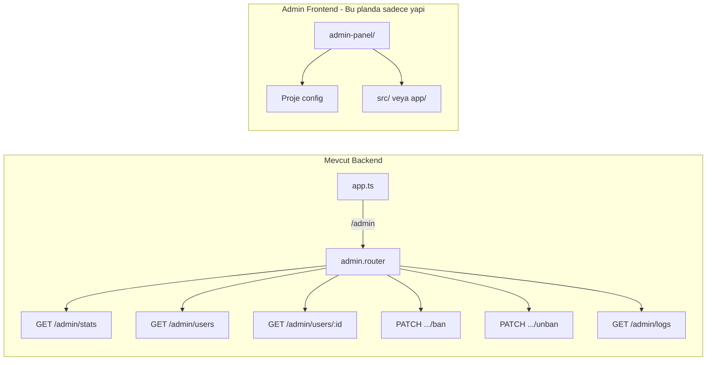

# Admin Panel API ve Frontend Yapisi Plani

Mevcut backend yapisina uygun sekilde tum admin endpoint'leri tek `/admin` prefix'i altinda toplanacak; Swagger'da `api/v1` gibi ust gruplar yok, path'ler dogrudan mount path ile uyumlu (ornegin [cache.router.ts](backend/src/interfaces/cache/cache.router.ts) `/api/cache` mount, doc'da path `/cache/metrics` degil gercek path kullanilabilir - seed'de `/api/seeds` yazili). Admin icin tutarli secim: **client'in cagirdigi tam path** Swagger'da yazilacak, yani `/admin/...`. Frontend tarafi sadece proje tanimi ve dizin yapisi; ekranlar sonraki planda.

---

## 1. Mevcut Yapi Ozeti

- **Route mount:** [app.ts](backend/src/interfaces/app.ts) icinde `app.use('/users', ...)`, `app.use('/api/cache', ...)` vb. Global `api/v1` prefix yok.
- **Swagger:** [swagger.config.ts](backend/src/infrastructure/config/swagger.config.ts) `src/interfaces/**/*.ts` taranir; her router'da `@openapi` ile path (tam URL path) ve `tags` verilir (ornegin [notification.router.ts](backend/src/interfaces/notification/notification.router.ts) `/notifications`, [seed.router.ts](backend/src/interfaces/seed/seed.router.ts) `/api/seeds).
- **Auth/RBAC:** [authMiddleware](backend/src/interfaces/auth/auth.middleware.ts) + [requireRole / requireAdmin](backend/src/infrastructure/middleware/rbac.middleware.ts) (ADMIN rolü mevcut).
- **Domain:** [AdminLog](backend/src/domain/admin/admin-log.entity.ts) ve Prisma'da `AdminLog` tablosu mevcut.

---

## 2. Backend: Admin API Modulu

### 2.1 Mount ve Path Stratejisi

- Tek prefix: `**/admin**`. Tum admin route'lari bu altinda olacak.
- [app.ts](backend/src/interfaces/app.ts): `app.use('/admin', adminRouter);` (dashboard'dan once, error handler'dan once).
- Swagger'da her endpoint icin **path tam olarak `/admin/...**` yazilacak ve **tags: [Admin]** verilecek; böylece Swagger UI'da tek "Admin" basligi altinda toplanir, mevcut dokümantasyon yapisina ek bir ust grup (api/v1) eklenmez.

### 2.2 Dizin Yapisi

```
backend/src/
├── interfaces/
│   └── admin/
│       ├── admin.router.ts      # Ana router: /admin mount, alt route'lar burada veya alt dosyalarda
│       ├── admin-users.router.ts # Opsiyonel: kullanici listesi/detay/ban (sub-router)
│       └── admin.dto.ts         # Opsiyonel: response tipleri
├── application/
│   └── admin/
│       └── admin-stats.service.ts  # Basit istatistik (opsiyonel, basit EP'ler dogrudan repo da kullanabilir)
```

- Basit kurgu icin tum route'lar tek `admin.router.ts` icinde de tutulabilir; buyurse `admin-users.router.ts` gibi alt router'lara bolunur.

### 2.3 Basit Admin Endpoint'leri (Ilk Asama)

Asagidakiler mevcut yapiyla uyumlu, sadece admin rolü (authMiddleware + requireAdmin) ile acilir:


| Method | Path                     | Aciklama                                                                      |
| ------ | ------------------------ | ----------------------------------------------------------------------------- |
| GET    | `/admin/stats`           | Genel istatistikler (kullanici sayisi, post sayisi vb. - basit sayimlar)      |
| GET    | `/admin/users`           | Kullanici listesi (sayfalama: limit/offset veya cursor, sadece temel alanlar) |
| GET    | `/admin/users/:id`       | Tek kullanici detayi (admin gorunumu)                                         |
| PATCH  | `/admin/users/:id/ban`   | Kullanici ban (body: reason vb. opsiyonel)                                    |
| PATCH  | `/admin/users/:id/unban` | Ban kaldir                                                                    |
| GET    | `/admin/logs`            | AdminLog listesi (sayfalama, son islemler)                                    |


- Response formatlari mevcut DTO/response pattern'ine uygun (ornegin `{ data: T }` veya `{ data: T, pagination?: ... }`).
- Ban/unban icin uygulama katmaninda mevcut [UserService](backend/src/application/user/user.service.ts) veya Prisma kullanilir; kritik islemlerde [AdminLog](backend/src/domain/admin/admin-log.entity.ts) kullanimi (Prisma uzerinden kayit) rapora uygun audit icin planlanir.

### 2.4 Swagger Dokumantasyonu

- Her route icin `@openapi` bloklari:
  - `path`: Tam path, ornek `/admin/stats`, `/admin/users`, `/admin/users/{id}`, `/admin/users/{id}/ban`, `/admin/users/{id}/unban`, `/admin/logs`.
  - `tags: [Admin]` (hepsi ayni tag ile Swagger'da "Admin" altinda listelenir).
  - `security: [{ bearerAuth: [] }]`.
  - Ozet ve response'lar mevcut router orneklerine benzer sekilde.

Bu sayede Swagger'da api/v1 gibi ek bir gruplama olmadan, dogrudan "Admin" basligi altinda tum admin EP'leri gorunur.

### 2.5 Guvenlik ve Rate Limiting

- Tum `/admin/*` route'larinda: `authMiddleware` + `requireAdmin` (veya `requireRole('ADMIN')`).
- Rate limiting rapora gore ileride eklenebilir; ilk asamada opsiyonel.

---

## 3. Frontend: Proje Tanimi ve Yapi (Ekransiz)

- **Konum:** Ayni repo icinde, ornek: `**admin-panel/**` (repo kokunde, `backend/` ve `catalog-service/` ile ayni seviyede).
- **Teknoloji:** React (Vite) veya Next.js; tercih projede kullanilana gore belirlenir. Sadece proje yapisi kurgulanacak.
- **Kapsam (bu plan):**
  - `admin-panel/` altinda proje olusturulmasi (package.json, temel config: tsconfig, vite/next config, eslint/prettier uyumu).
  - Temel dizin yapisi: ornek `src/` (veya `app/` Next ise), `public/`, env ornegi (`.env.example`) ile API base URL (backend `/admin` prefix'ini kullanacak).
  - Docker tarafi: Bu planda sadece "ileride docker-compose'a admin-panel servisi eklenecek, build ciktisi nginx veya ayri container ile sunulacak" notu; implementasyon detayi opsiyonel.
- **Kapsam disi:** Sayfa/ekran tasarimi, routing, login ekrani, API cagrilari — bunlar ayri bir "Admin Frontend Ekranlari" planinda ele alinacak.

---

## 4. Ozet Akis




---

## 5. Uygulama Adimlari (Ozet)

1. **backend/src/interfaces/admin/** klasorunu olustur; `admin.router.ts` ile tum basit EP'leri tanimla (stats, users list/detail, ban/unban, logs); gerekirse `admin-users.router.ts` ve `admin-stats.service.ts` ile ayir.
2. **app.ts** icinde `adminRouter` import et ve `app.use('/admin', adminRouter)` ekle (dashboard route'larindan once).
3. Her admin endpoint icin Swagger `@openapi` bloklarini ekle: path `/admin/...`, tags `[Admin]`, security bearerAuth.
4. **admin-panel/** projesini repo kokunde kur (Vite+React veya Next.js), temel dizin yapisi ve config; ekranlar ve entegrasyon sonraki planda.

Bu plan, API route'lari mevcut yapiya uygun tek `/admin` basligi altinda toplar ve Swagger'da da tek "Admin" grubunda gosterir; frontend tarafinda ise sadece proje tanimi ve yapi kurgusu ile sinirli kalir.