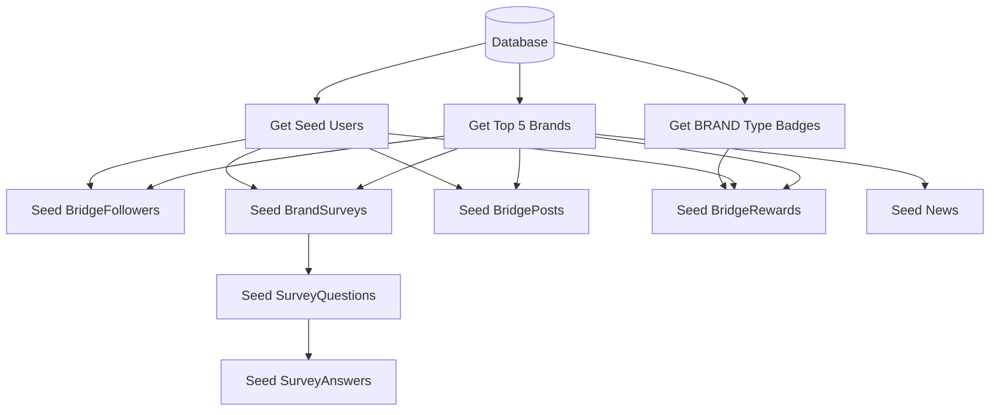

# Brand Catalog Seed Implementation

## Overview

Create a new step file `brand-catalog.seed.ts` in the existing seed steps structure. This file will generate test data for Brand Catalog endpoints using existing brands from the database (top 5 brands by product count).

## File Structure

```
backend/prisma/seed/steps/
├── system.seed.ts
├── identity.seed.ts
├── gamification-user-state.seed.ts
├── auth-edge.seed.ts
└── brand-catalog.seed.ts  ← NEW
```

## Data Flow



## Implementation Details

### 1. Main Export Function

Create `seedBrandCatalog(prisma: PrismaClient)` as the main entry point:

```typescript
export async function seedBrandCatalog(prisma: PrismaClient): Promise<void> {
  console.log('Brand Catalog seeding starting...')
  
  const topBrands = await getTopBrandsByProductCount(prisma, 5)
  if (topBrands.length === 0) {
    console.warn('No brands found in database, skipping Brand Catalog seed')
    return
  }
  
  const users = await prisma.user.findMany({ take: 40 })
  const badges = await prisma.badge.findMany({ where: { type: 'BRAND' } })
  
  await seedBridgeFollowers(prisma, topBrands, users)
  await seedBrandSurveys(prisma, topBrands, users)
  await seedBridgePosts(prisma, topBrands, users)
  await seedBridgeRewards(prisma, topBrands, users, badges)
  await seedBrandNews(prisma, topBrands)
  
  console.log('Brand Catalog seeding completed')
}
```

### 2. Helper Function - Get Top Brands

```typescript
async function getTopBrandsByProductCount(prisma: PrismaClient, limit = 5) {
  return prisma.brand.findMany({
    include: { _count: { select: { products: true } } },
    orderBy: { products: { _count: 'desc' } },
    take: limit
  })
}
```

### 3. Seed Functions

#### BridgeFollowers

- 5-15 random followers per brand
- Use upsert to avoid duplicates

#### BrandSurveys (SINGLE_CHOICE)

- 2 surveys per brand with English titles
- Survey templates:
  - "Product Satisfaction Survey" (3 questions)
  - "Feature Preferences Survey" (3 questions)
- Questions with 4 answer options each
- 3-5 user responses per question

#### BridgePosts

- 5-10 posts per brand
- ULID format IDs (use `ulid` package or custom generator)
- English content templates

#### BridgeRewards

- Based on schema: only `userId`, `brandId`, `badgeId`, `awardedAt`
- No `points` or `reason` fields (schema correction from MD file)
- 5-10 rewards per brand using BRAND type badges

#### News

- 3 news articles per brand
- Based on schema fields: `title`, `content`, `bannerImageUrl`, `source`, `author`, `tags`
- English content

### 4. English Content Templates

```typescript
const SURVEY_TEMPLATES = [
  {
    title: 'Product Satisfaction Survey',
    description: 'Help us improve your experience with our products',
    questions: [
      { text: 'How satisfied are you with the product quality?', options: ['Very Satisfied', 'Satisfied', 'Neutral', 'Dissatisfied'] },
      { text: 'How likely are you to recommend this brand?', options: ['Very Likely', 'Likely', 'Neutral', 'Unlikely'] },
      { text: 'How would you rate the value for money?', options: ['Excellent', 'Good', 'Average', 'Poor'] }
    ]
  },
  {
    title: 'Feature Preferences Survey',
    description: 'Tell us what features matter most to you',
    questions: [
      { text: 'Which feature is most important to you?', options: ['Performance', 'Design', 'Price', 'Durability'] },
      { text: 'How often do you use this product?', options: ['Daily', 'Weekly', 'Monthly', 'Rarely'] },
      { text: 'Where do you primarily use this product?', options: ['Home', 'Office', 'Outdoors', 'Travel'] }
    ]
  }
]

const NEWS_TEMPLATES = [
  { title: 'New Product Launch', tags: ['launch', 'new', 'product'] },
  { title: 'Special Promotion Announcement', tags: ['promotion', 'discount', 'offer'] },
  { title: 'Technology Innovation Update', tags: ['technology', 'innovation', 'update'] }
]

const POST_TEMPLATES = [
  'Just had an amazing experience with {brand}! Highly recommend their products.',
  'Been using {brand} products for a while now and the quality is outstanding.',
  'Sharing my thoughts on the latest {brand} release - exceeded my expectations!',
  'Customer service at {brand} was exceptional. Great support team!',
  'Comparing {brand} with competitors - they definitely stand out in quality.'
]
```

### 5. Integration Point

In [backend/prisma/seed.ts](backend/prisma/seed.ts), add the import and call after Event/Marketplace badges seeding:

```typescript
import { seedBrandCatalog } from './seed/steps/brand-catalog.seed'

// In main() function, after event badges section:
console.log('Brand Catalog data seeding starting...')
await seedBrandCatalog(prisma)
console.log('Brand Catalog data seeding completed')
```

## Dependencies

- Existing `ulid` package or implement ULID generator for BridgePost IDs
- BRAND type badges must exist (created in system.seed.ts)
- Users must exist (created in identity.seed.ts)
- Brands must exist in database (pre-populated externally)

## Expected Output

For each of the top 5 brands:

- 5-15 BridgeFollower records
- 2 BrandSurvey records (6 questions total, 18-30 answers)
- 10-15 BridgePost records
- 5-10 BridgeReward records
- 3 News records

Total estimated records:

- BridgeFollower: 25-75
- BrandSurvey: 10
- BrandSurveyQuestion: 30
- BrandSurveyAnswer: 90-150
- BridgePost: 50-75
- BridgeReward: 25-50
- News: 15